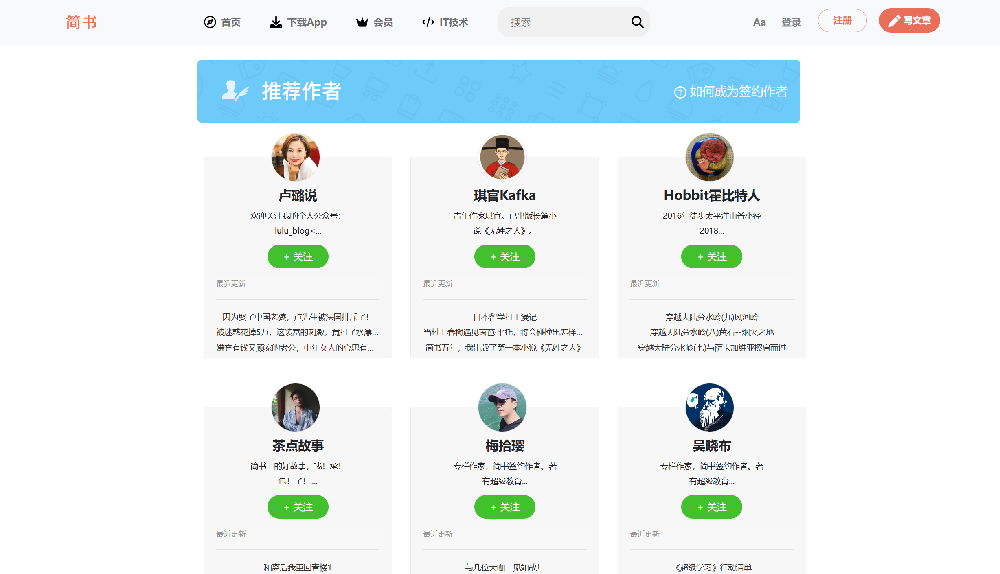
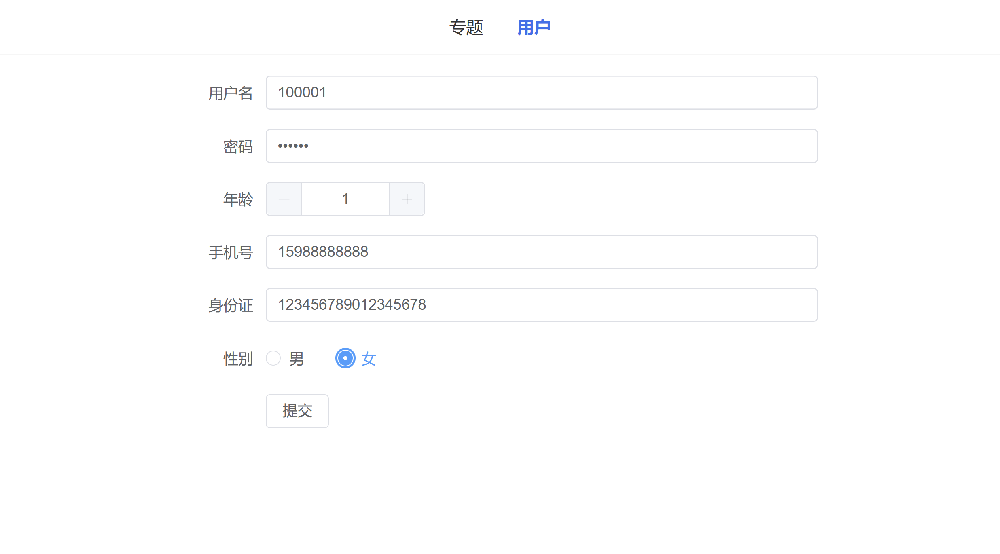

# Spring Boot Learning Project

@RainbowCloud_CrispShark

**1. Spring Boot Quickstart Practice**

Module Name: `spring-boot-quickstart`

Module Description:
This module focuses on setting up the Spring Boot framework. Through simple examples, it demonstrates how to create a Spring Boot project, learn about the rapid development and API writing in Spring Boot, use Restful to implement API testing, and import Maven dependencies.

------

**2. Spring Boot Configuration Management**

Module Name: `spring-boot-config`

Module Description:
This module covers the configuration management functionality of Spring Boot. It includes: 1) Writing configuration files (such as application.properties or application.yml); 2) How to manage various application properties through configuration files; 3) How to leverage Spring Boot's Profile functionality to switch configurations based on different environments.

------

**3. Spring Boot Integration with Static Resources and Template Engines**

Module Name: `spring-boot-template`

Module Description:
This module demonstrates how Spring Boot integrates with static resources and template engines to build a portal website. It covers: How to place static resources in the correct locations so that Spring Boot can automatically identify and load them; How to use template engines to construct static pages, and use the Bootstrap framework to mimic the recommended user interface of Jianshu.

------

**4. Spring Boot Integration with Database Frameworks**

Module Name: `spring-boot-database`

Module Description:
This module covers how to use Spring Boot to integrate with database frameworks, such as MyBatis and JPA. It includes: How to write entity classes, how to write Mapper interfaces, how to write Service interfaces, and how to write Controller interfaces.

------

**5. Spring Boot Integration with MyBatis Comprehensive Practice**

Module Name: `spring-boot-mybatis`

Module Description:
This module focuses on how to use Spring Boot to integrate with MyBatis. It implements MyBatis association queries, such as one-to-one, one-to-many, many-to-one, fuzzy queries, and multi-table queries, and writes test classes to test the execution results of the Mapper.

------

**5.5. Spring Boot Integration with MyBatis-Plus Comprehensive Practice**

Module Name: `spring-boot-mybatis-plus` and `spring-boot-mp`

Module Description:
This module covers how to use Spring Boot to integrate with MyBatis-Plus. It includes: How to use the annotation-based approach of MyBatis-Plus to implement CRUD operations, how to use the condition builder of MyBatis-Plus, how to use the pagination plugin of MyBatis-Plus, and how to use the BaseMapper of MyBatis-Plus to simplify Mapper writing.

------

**6. Spring Boot Logging Framework and Log Management**

Module Name: `spring-boot-log`

Module Description:
This module focuses on how to configure and manage logs in Spring Boot, including: Using Spring Boot's default Logback logging framework, using the log4j2 logging framework, configuring the log4j2 log level, configuring the log4j2 log format, configuring the log4j2 log path (console, file, rolling file, etc.), and using the Logging system provided by Spring Boot.

------

**7. Global Unified Exception Handling**

Module Name: `spring-boot-exception`

Module Description:
This module covers how to implement a general global exception handling logic in Spring Boot, customize exceptions and related data structures, and use Spring Validation for data validation. It includes: Customizing exception classes, using Spring Validation for data validation, and using the `@Valid` annotation on business layer method parameters for data validation.

------

**8. Integrating Distributed File Systems**

Module Name: `spring-boot-file`

Module Description:
This module demonstrates how to integrate distributed file systems into a Spring Boot project, including local file upload and access services, as well as integration with MinIO and Alibaba Cloud OSS solutions. The specific contents include:

- Implementation of local file upload and access services.
- Introduction to MinIO object storage service and integration with Spring Boot for file storage and access.
- Introduction to Alibaba Cloud Object Storage Service (OSS) and integration with Spring Boot for file storage and access.

------
**Pending: Spring Boot Integration with Redis Cache Database**

Module Name: `spring-boot-redis`

Module Description:
This module focuses on how to use Spring Boot to integrate with the Redis cache database. It covers: How to use Spring Boot to integrate with Redis, how to use the RedisTemplate to operate Redis, and how to use Redis caching to improve system performance.