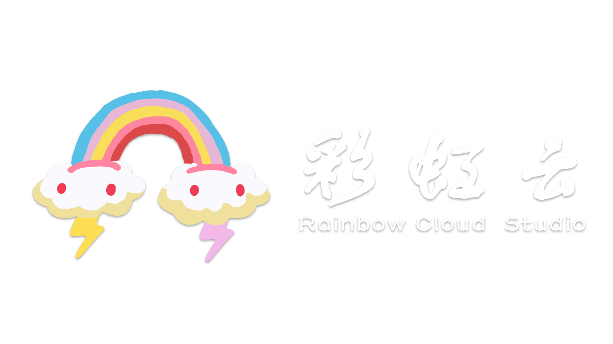

# Spring Boot 学习项目
@RainbowCloud_CrispShark

**一、Spring Boot起步练习**

模块名称：`spring-boot-quickstart`

模块描述：
本模块学习搭建Spring Boot框架，通过简单的示例演示如何创建一个Spring Boot项目，学习Spring Boot的快速搭建和接口编写，使用Restful实现接口的测试，还有导入Maven依赖。

------

**二、Spring Boot配置管理**

模块名称：`spring-boot-config`

模块描述：
本模块学习Spring Boot的配置管理功能。学习1、编写配置文件（如application.properties或application.yml）；2、如何通过配置文件管理应用的各种属性；3、如何利用Spring Boot提供的Profile功能实现不同环境下的配置切换。

------

**三、Spring Boot整合静态资源与模板引擎**

模块名称：`spring-boot-template`

模块描述：
本模块示Spring Boot如何整合静态资源和模板引擎编写一个门户网站。学习如何将静态资源放置在正确的位置，以便Spring Boot能够自动识别和加载。学习如何使用模板引擎来构建静态页面，使用bootstrap框架仿制简书的推荐用户界面。

------
**四、Spring Boot整合数据库框架**

模块名称：`spring-boot-database`

模块描述：
本模块学习如何使用Spring Boot整合数据库框架，如MyBatis、JPA等。学习如何编写实体类，如何编写Mapper接口，如何编写Service接口，如何编写Controller接口。

------
**五、Spring Boot整合Mybatis综合练习**

模块名称：`spring-boot-mybatis`

模块描述：
本模块学习如何使用Spring Boot整合mybatis。实现MyBatis的关联查询，如一对一，一对多，多对一，模糊查询，多表查询等，并编写测试类测试Mapper执行的结果。
------
**六、Spring Boot整合Mybatis-plus综合练习**

模块名称：`spring-boot-mybatis-plus`

模块描述：
本模块学习如何使用Spring Boot整合Mybatis-plus。学习如何使用Mybatis-plus的注解方式实现CRUD操作，如何使用Mybatis-plus的条件构造器，如何使用Mybatis-plus的分页插件等，如何使用Mybatis-plus的BaseMapper简化Mapper书写。

------
**待定、Spring Boot整合Redis缓存数据库**

模块名称：`spring-boot-redis`

模块描述：
本模块学习如何使用Spring Boot整合Redis缓存数据库。Redis是一个开源的、使用ANSI C语言编写的、支持网络、可基于内存亦可持久化的日志型、Key-Value数据库。学习如何使用Spring Boot整合Redis，如何使用RedisTemplate操作Redis，如何使用Redis缓存数据，提高系统性能。