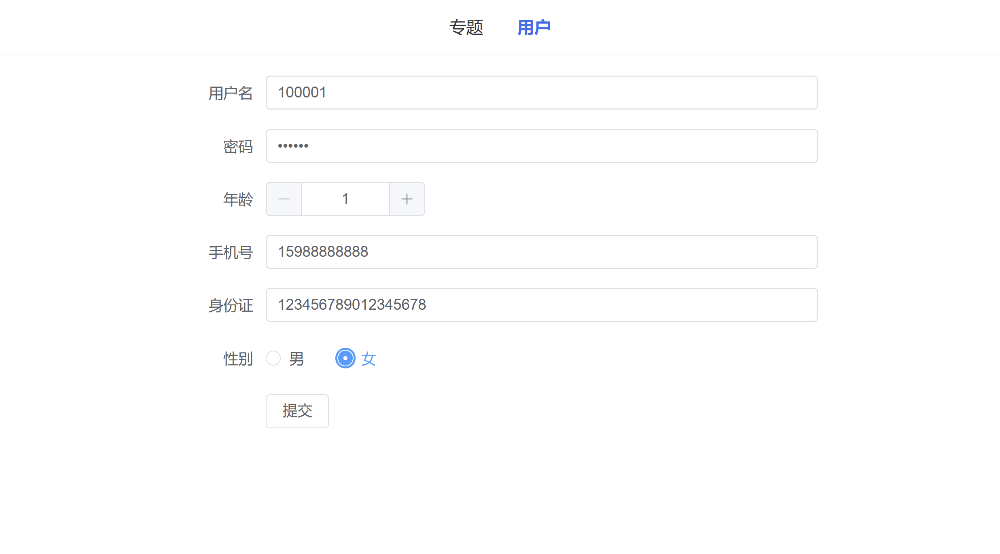

# Spring Boot 学习项目

@RainbowCloud_CrispShark

**1. Spring Boot起步练习**

模块名称：`spring-boot-quickstart`

模块描述：
本模块学习搭建Spring Boot框架，通过简单的示例演示如何创建一个Spring Boot项目，学习Spring Boot的快速搭建和接口编写，使用Restful实现接口的测试，还有导入Maven依赖。

------

**2. Spring Boot配置管理**

模块名称：`spring-boot-config`

模块描述：
本模块学习Spring Boot的配置管理功能。学习1、编写配置文件（如application.properties或application.yml）；2、如何通过配置文件管理应用的各种属性；3、如何利用Spring Boot提供的Profile功能实现不同环境下的配置切换。

------

**3. Spring Boot整合静态资源与模板引擎**

模块名称：`spring-boot-template`

模块描述：
本模块示Spring Boot如何整合静态资源和模板引擎编写一个门户网站。学习如何将静态资源放置在正确的位置，以便Spring Boot能够自动识别和加载。学习如何使用模板引擎来构建静态页面，使用bootstrap框架仿制简书的推荐用户界面。

------

**4. Spring Boot整合数据库框架**

模块名称：`spring-boot-database`

模块描述：
本模块学习如何使用Spring Boot整合数据库框架，如MyBatis、JPA等。学习如何编写实体类，如何编写Mapper接口，如何编写Service接口，如何编写Controller接口。

------

**5. Spring Boot整合Mybatis综合练习**

模块名称：`spring-boot-mybatis`

模块描述：
本模块学习如何使用Spring Boot整合mybatis。实现MyBatis的关联查询，如一对一，一对多，多对一，模糊查询，多表查询等，并编写测试类测试Mapper执行的结果。

------

**5.5. Spring Boot整合Mybatis-plus综合练习**

模块名称：`spring-boot-mybatis-plus`和`spring-boot-mp`

模块描述：
本模块学习如何使用Spring Boot整合Mybatis-plus。学习如何使用Mybatis-plus的注解方式实现CRUD操作，如何使用Mybatis-plus的条件构造器，如何使用Mybatis-plus的分页插件等，如何使用Mybatis-plus的BaseMapper简化Mapper书写。

------

**6. Spring Boot日志框架与日志管理**

模块名称：`spring-boot-log`

模块描述：
本模块学习如何在Spring Boot中配置和管理日志,包括:使用Spring Boot默认的Logback日志框架、使用log4j2日志框架、配置log4j2的日志级别、配置log4j2的日志格式、配置log4j2的日志路径(控制台,文件,滚动文件等)、使用Spring Boot提供的Logging系统。

------

**7. 全局统一异常处理**

模块名称：`spring-boot-exception`

模块描述：
本模块学习如何在Spring Boot中实现通用全局异常处理逻辑,自定义异常和相关数据结构,以及使用Spring Validation进行数据校验。包括以下内容:自定义异常类 ，使用Spring Validation进行数据校验，在业务层方法参数上使用@Valid注解进行数据校验 自定义校验规则

------

**8. 整合分布式文件系统**

模块名称：`spring-boot-file`

模块描述：
该模块介绍了如何在Spring Boot项目中整合分布式文件系统，包括本地文件上传与访问服务，以及集成MinIO和阿里云OSS两种方案。具体内容包括：

- 实现文件的本地上传，并提供访问服务。
- 实现简介MinIO对象存储服务，以及如何在Spring Boot项目中使用MinIO实现文件存储与访问。
- 实现阿里云对象存储OSS服务，以及如何在Spring Boot项目中使用阿里云OSS实现文件存储与访问。

------

**9、Spring Boot整合Redis缓存数据库**

模块名称：`spring-boot-cache`和`spring-boot-reids-example`

模块描述：
本模块学习如何使用Spring Boot整合Redis缓存数据库。学习使用Spring Boot整合Redis，如何使用RedisTemplate操作Redis，如何使用Redis缓存数据，提高系统性能。并且集成容联云短信服务，实现短信验证码功能。

------

**10、Spring Boot中使用拦截器和过滤器**

模块名称：`spring-boot-filter-interceptor`

模块描述：
本模块介绍了在Spring Boot项目中如何使用拦截器和过滤器进行请求的拦截和处理。具体内容包括： 使用Spring Boot中的拦截器实现对请求的拦截和处理。 使用Spring Boot中的过滤器实现对请求和响应的拦截和处理。 拦截器和过滤器的区别和适用场景。
如何在Spring Boot中注册和配置拦截器和过滤器。 示例演示：实现对请求进行身份认证的拦截器和过滤器。

------

**11、Spring Boot整合邮件发送**

模块名称：`spring-boot-mail`

模块描述：
在这个模块中，我们学习如何在 Spring Boot 项目中实现邮件发送功能。学习如何配置 Spring Boot 以便发送电子邮件，以及如何使用 JavaMailSender 实现邮件发送。此外，还将学习如何处理邮件模板，以及如何处理邮件发送过程中可能出现的异常情况。通过这个模块，我们可以使我们的应用程序具备发送邮件的能力，从而实现更多样化的功能和更好的用户体验。

------

**12、Spring Boot中实现异步操作和定时调度**

模块名称：`spring-boot-task`

模块描述：
在这个模块中，学习 Spring Boot 应用程序中实现异步操作和定时调度。首先，学习如何使用 @Async 注解来实现异步方法，从而提高系统的并发能力和性能。如何使用 @Scheduled 注解来实现定时任务，例如在固定的时间间隔或特定的时间点执行某些任务。

------

**13、服务器推送技术**

模块名称：`spring-boot-websocket`

模块描述：在这个模块中，将学习利用 Spring Boot 中的 WebSocket 实现实时数据传输。WebSocket 提供了一种在客户端和服务器之间建立持久连接的方式，可以实现双向通信，适用于需要实时更新数据的场景。通过这个模块，学习如何在 Spring Boot 项目中集成 WebSocket，并利用它来实现服务器推送，从而实现更加灵活和实时的数据交互。

------

**14、应用程序监控管理**

模块名称：`spring-boot-actuator`

模块描述：在这个模块中，将学习如何在 Spring Boot 应用程序中实现应用程序监控和管理功能。通过集成监控工具，我们可以实时监控应用程序的运行状态、性能指标和异常情况，以便及时发现并解决问题。

------